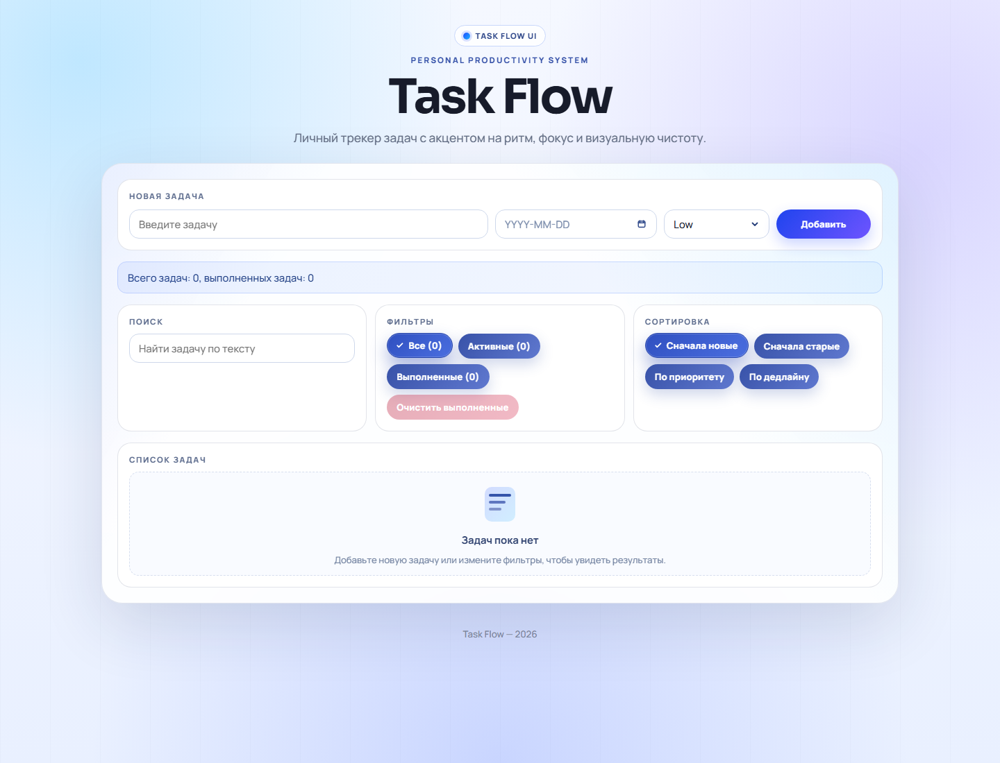

# Task Flow

Task Flow is a portfolio task manager focused on clean UI, practical productivity flows, and readable vanilla JavaScript.

## Status

The project is in portfolio polish stage. Core functionality is ready; screenshots and live deployment are the next publishing steps.

## Live Demo

Not deployed yet.

## Preview



Additional QA screenshots:

- [Mobile preview](./assets/screenshots/mobile.png)
- [404 page](./assets/screenshots/404.png)

## Features

- Create, edit, complete, and delete tasks
- Task priority and deadline support
- Filters: all, active, completed
- Sort modes: newest, oldest, priority, deadline
- Debounced search
- Local persistence with `localStorage`
- Custom animated priority dropdown
- Custom date picker with month navigation
- Empty-state illustration and polished micro-interactions
- Reduced-motion friendly delete behavior
- Safe search highlighting without injecting user text as HTML

## Tech Stack

- HTML5
- CSS3
- Vanilla JavaScript
- LocalStorage API

## Project Structure

```text
task-manager/
  index.html
  404.html
  assets/
    icons/
      favicon.svg
    og/
      og-image.svg
    screenshots/
      .gitkeep
  src/
    css/
      styles.css
    js/
      app.js
  README.md
  LICENSE
  .gitignore
```

## What I Practiced

- DOM rendering without a framework
- Client-side state management
- Filtering, sorting, and search logic
- Local data persistence
- Form validation
- Accessible button labels and focus states
- Defensive rendering of user-entered text
- UI states: empty, active, completed, overdue, editing
- Small UX details: counters, animations, custom controls, and reduced-motion support

## Local Run

Open `index.html` in a browser.

For a smoother development workflow, run the project with a local static server such as the Live Server extension.

## Deployment

This project can be deployed as a static site:

1. Push the repository to GitHub.
2. Import the repository into Vercel or Netlify.
3. Set the publish directory to the repository root.
4. Confirm `index.html` is used as the entry point.
5. Add the live URL to the **Live Demo** section.

## QA Checklist Before Final Publish

- Add task, edit task, mark done, delete task
- Filter and sort interactions
- Search behavior and empty states
- Deadline validation, including past-date restriction
- Page refresh persistence with `localStorage`
- Mobile layout checks
- Reduced-motion delete behavior
- 404 page check
- Screenshots and live demo link

## Future Improvements

- Split JavaScript into small modules when the project moves to a bundled setup
- Add import/export for tasks as a practical productivity feature
- Add a compact statistics panel for active, completed, and overdue tasks

## License

This project is licensed under the MIT License. See [LICENSE](./LICENSE).

